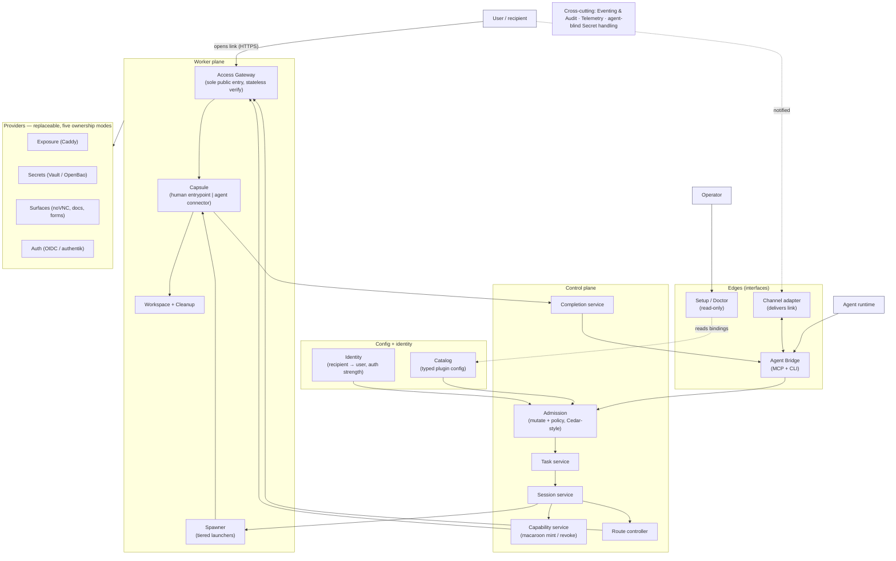

# 01 · Architecture Overview

This document is the architectural north star for the project. It states what we are building, the one idea the whole system turns on, the principles that constrain every later decision, the component shape, the runtime loop, and — because the project is delivered by two cooperating codebases — the boundary between the **runtime** we operate and the **installer** (`work-package-manager`) that stands it up.

It is a *synthesis*. It picks one direction for every decision the prior exploration left contested, keeps the parts of that exploration that were independently right (the user stories, the security invariants, the dependency-ownership concept, the two-actor capsule), and discards the machinery that turned out to be the system trying to do a job that belongs to the agent or to the installer. Where a downstream document needs to go deeper, this one is the frame it must stay inside.

> **How to read this:** §1–§3 are the *why* and the *rules* — read them once and hold them. §4–§7 are the *what* — the components, the loop, security, extensibility. §8 is the *seam* with `work-package-manager` and is the most load-bearing section for anyone deciding where a piece of work lives. §9 records what we commit to and what we deliberately defer. §10 is the shared vocabulary every other doc assumes.

---

## 1. What GLA is — and is not

**Gateway Live Access (GLA) is a self-hostable control plane between an AI agent and a human user, for temporary, scoped, recipient-bound interaction surfaces.** It exists for the moment an agent hits a step it cannot or should not do itself: a same-session OAuth/2FA login, an agent-blind secret entry, a document last-mile edit, a file-pick-by-content, a destructive-action approval, a live app-preview review, a group-to-private handoff.

The product is a single loop:

> The agent assembles a temporary, scoped surface — a **session** — and GLA *validates, enforces, hosts, and tears it down*. The user opens a link from a chat and finds a browser session, a form, a document editor, or a confirmation dialog; the agent works alongside the user or waits; the session completes; GLA returns structured **completion**; the agent resumes its task.

The framing that keeps us honest about scope: **GLA is to agent↔human handoffs what MCP is to agent↔tool calls, OIDC is to identity, and LSP is to editor↔language** — a thin standard layer the surrounding ecosystem can converge on.

GLA **is not** a planner of intent, a chatbot framework, a workflow engine, an identity provider, or an agent runtime. It mediates between those things and owns none of them.

The reference slice is Telegram + Hermes, but it is a *slice*, not the center. Slack, WhatsApp, Email, CLI, OpenClaw, and future runtimes are first-class peers added one at a time.

---

## 2. The central idea: the two-actor capsule

Every prior iteration eventually converged on one shape, and it is the shape that makes the product coherent. There are **two completely separate doors**, and they meet at exactly one object.

- The **agent** enters on one door — the **Agent Bridge** — talks only to the control plane, and is *unprivileged*: it never receives the Docker socket, the gateway admin API, or raw secrets (it does direct which of its *own* host paths to mount into a capsule — `04-capsule-assembly.md` §6 — but with its own authority, never reaching GLA-blind resources). It gets back capability references and structured results.
- The **user** enters on the other door — the **Access Gateway** — by tapping a link. Their traffic transits the gateway and nothing else public exists.

Both paths converge on the **capsule**: a lightweight, temporary, scoped working shell around whatever must be acted on. A capsule exposes two interfaces over the same underlying state:

- a **Human Entrypoint** — the user-facing protocol (a noVNC browser stream, a static page, a web form, a file browser, a document editor, a terminal); and
- an **Agent Connector** — the agent-side handle (a CDP endpoint, a filesystem path, a `secret_ref`, a local HTTP port, a process stdio).

A capsule is *not* a Docker container; a container is one way to isolate one. The capsule is the controlled boundary around the thing being worked on, plus its access policy, coordination, completion signal, and cleanup. This two-actor capsule is the unit the rest of the architecture serves.

---

## 3. Principles

Each principle is here because it forecloses a specific failure mode. They are not negotiable in later designs.

1. **Narrow waist over provider abstractions.** A tiny stable core — `Task`, `Session`, `Capability`, `Route`, `Completion`, `Audit`, with `Recipient` and `Capsule` as the things they act on — is the only thing that must stay stable. Everything else (channels, runtimes, auth, secret stores, surfaces, exposure, spawners, completion detectors) is a replaceable adapter behind an anti-corruption layer. This is the hourglass / Cockburn / Evans / NIST position.
2. **The agent assembles; GLA validates.** The agent reads structured component documentation and proposes a *concrete* session. GLA does not interpret intent or match resources — it accepts or rejects one concrete proposal, then enforces, hosts, and returns completion. The agent's understanding of what the user wants stays in the agent; the system never models it.
3. **Recipient-bound grants.** A grant is bound to one recipient. A forwarded link is useless in someone else's hands. WebSockets are authorized on upgrade and force-closed on grant termination.
4. **Agent-blind secrets.** The agent receives only `secret_ref` capabilities. Raw secrets never enter chat, prompts, transcripts, logs, evidence, or the agent's address space when the design can avoid it.
5. **One public entry; the agent is unprivileged.** Every public request transits the Access Gateway and passes capability + policy validation. The agent plane never holds a privileged path.
6. **Capabilities are the universal authorization currency.** Agent authority, session grants, secret refs, channel delegations, and operator confirmations are all the same primitive — signed bearer credentials with caveats (Macaroon-style). One verifier shape, one mental model, distributed verification, central revocation.
7. **The catalog is the typed configuration model.** Backstage/Kubernetes-shape entities for every plugin, policy, and authority profile. Same ingestion, same lint, same git workflow for everything operators author. Status is *system-derived*, not author-declared.
8. **The edge verifies statelessly.** The Access Gateway verifies grant tokens cryptographically with no database round-trip in the common case. Revocation propagates through a small replicated cache.
9. **Reconcile only where reliability requires it.** Start with one cleanup reconciler. Add others (route consistency, capsule orphan detection) only when a real failure mode demands them. The system does not reconcile for its own sake.
10. **The agent has its own knowledge layer; the user does not.** Anything the *user* experiences must be implemented in the system. Anything only the *agent* needs is shipped as a **skill** (a markdown how-to the agent loads on demand), not built as a mechanism.
11. **Provider neutrality with surface pluralism.** The reference slice is one of many. The Agent Bridge exposes two equivalent surfaces — an MCP server and a CLI command tree — backed by the same primitives, with surface parity as an invariant.

---

## 4. Component architecture

The eight-plane taxonomy from the prior exploration collapses, for working purposes, into four zones plus a cross-cutting spine. What matters is the request flow, not the ceremony of naming planes.

**Edges** are the only entry points. The **Agent Bridge** is the agent's door (MCP server + CLI, with parity); the **Channel adapter** delivers links and renders multi-step progress to the user; **Setup / Doctor** is a thin, *read-only* surface for the operator (see §8 — the *acting* setup lives in the installer).

**Config + identity** is slow-changing, git-tracked input. The **Catalog** is the typed model of what is installable and currently available; **Identity** maps channel-specific recipients to stable users, **enrolls** them (the one-time registration of a passkey/credential bound to the recipient — the precondition for any handoff), and tracks how strongly each is verified.

**Control plane** is the brain and the narrow core. **Admission** runs a mutate-then-validate pipeline (Kubernetes admission-controller shape) over the agent's concrete proposal, consulting catalog, **policy** (Cedar-style PARC, forbid-wins, order-independent), capability, and identity. On acceptance, **Task** (multi-step coherence) drives **Session** (the per-handoff aggregate), which mints a **Capability**, programs a **Route**, and asks the worker plane to spawn the capsule. **Completion** normalizes the runtime's done-signal and hands it back to the Bridge.

**Worker plane** is the runtime substrate. The **Access Gateway** is the sole public entry and verifies macaroons statelessly on every request and WebSocket upgrade (HashiCorp Boundary's controller/worker split is the reference). The **Spawner** abstracts isolation tiers behind one interface (JupyterHub's Spawner pattern); the **Capsule** is the two-actor shell; **Workspace + Cleanup** realize and reap the working materials.

**Providers** are everything replaceable, each declared in the catalog and integrated behind its interface, each carrying its five **ownership modes** (§7).

**Cross-cutting** — eventing & append-only audit (indexed by task, redacted on egress), telemetry (OpenTelemetry), and agent-blind secret handling — underlies every plane.

---

## 5. The runtime loop

The loop is the same conceptual shape as a Temporal signal-await: the agent does work, durably waits for a human, and resumes.

**Precondition (one-time, not per task).** The recipient is *enrolled* — the operator has registered them and they have registered a credential (a passkey) with Identity + Auth, bound to their recipient identity and authorized by a single-use `operator-discharge` grant the gateway verifies like any other. Without it, no handoff can verify them at step 6.

1. **Connect & orient.** The agent connects to the Bridge and receives an `agent-authority` capability; it fetches the skill manifest and reads which templates, launchers, and entrypoints are available in *this* installation.
2. **Propose.** The agent assembles one concrete session (workspace + launcher + human entrypoint + agent connector + completion detector) and submits it.
3. **Admit.** Admission mutates (applies defaults) then validates (policy, capability scope, catalog availability, identity strength). It returns accept, or reject with a stable namespaced reason.
4. **Provision.** On accept, the Session mints a recipient-bound grant capability, programs a route on the Access Gateway, and spawns the capsule via the registered launcher.
5. **Deliver.** The channel adapter delivers the link to the bound recipient and renders progress.
6. **Act.** The user opens the link; the Access Gateway verifies the grant and proxies to the capsule's human entrypoint. The agent, if it participates live, drives the agent connector.
7. **Complete.** The completion detector fires; the Completion service validates its shape against the declared contract, normalizes it to an envelope, and delivers it to the Bridge.
8. **Resume & reap.** The agent resumes its task. The session reaches a terminal state; the cleanup reconciler tears down route, capsule, and workspace; the audit trail closes.

Partial failure is contained per session/task; resume and repair are the same loop pointed at a later starting state.

---

## 6. Authorization & security model

Authorization is one primitive used everywhere, which is what lets the edge stay stateless and the mental model stay small.

- **Capabilities** are signed bearer credentials with HMAC-chained caveats. Six classes share one verifier shape: `agent-authority`, `task`, `session`, `secret-ref`, `channel-delegation`, `operator-discharge`. Caveats encode recipient, time, scope, and network confinement.
- **Stateless verification at the edge.** The Access Gateway verifies cryptographically with no DB round-trip in the common path. Revocation rides a small replicated cache pushed from the Capability service.
- **Recipient binding** is a caveat, not a convention; the gateway enforces it on every request and upgrade.
- **Agent-blind secrets.** Secret stores are pluggable; the agent receives a `secret-ref` capability and never the value. Redaction scanners guard every egress.
- **Audit** is append-only, indexed by task, redacted on egress — the evidentiary backbone for operator review and incident response.

---

## 7. Extensibility: providers, dependencies, ownership

Extensibility is a **modular monolith with strict internal seams**, not a microservices mesh or a public plugin platform. A public extension API is deferred until at least two real providers exist in every family (the SemVer / Vault-plugin / VS Code "proposed API" discipline). Until then, the seams are internal.

Adding a capability later is **horizontal extension**: a new provider or dependency registers against an existing internal seam and **changes no core code** — the narrow waist (§3) is precisely what makes this possible. The system grows by adding adapters at the edges, never by editing the core.

A **plugin** is a self-contained package: code + a catalog entity + skills + docs + contract tests. The pluggable catalog kinds are `CapsuleTemplate`, `Launcher`, `HumanEntrypoint`, `AgentConnector`, `Workspace`, `CompletionDetector`, `Sidecar`, `Dependency`, `ChannelAdapter`, and the auth providers; operator-authored kinds (`AuthorityProfile`, `PolicyProfile`, `Skill`, `Location`) ship no code.

Two concepts that must not be conflated:

- A **Dependency** is *external software* (Caddy, Docker, Playwright, Vault, ONLYOFFICE).
- A **Provider** is the *GLA-side adapter* that integrates a dependency in a specific role.

One dependency can back several provider roles; one provider role can be backed by several dependencies.

Every dependency declares its supported **ownership modes**, which are how the same dependency installs into wildly different environments:

| Mode | Meaning | Who installed it | Reversible by us |
|---|---|---|---|
| **Managed** | GLA stands it up and owns its lifecycle | us | yes |
| **Local-External** | already present on the host; we adopt it | the operator | no (leave it) |
| **Remote-External** | reachable elsewhere; we only configure the connection | n/a | n/a |
| **Manual-BYO** | the operator wires it by hand, via a guided pause | the operator | no |
| **Disabled** | not enabled for this installation | n/a | n/a |

These five modes are the precise hinge to the installer (§8): GLA *declares* them; `work-package-manager` *satisfies* them in the real environment.

---

## 8. The boundary with `work-package-manager`

The project is delivered by two cooperating codebases. GLA is the **runtime** we operate; `work-package-manager` (`wpm`) produces the **installer** — an *agent-native* installer that ships a package of backlog bundles which the operator's own agent executes to stand the system up. Because every target environment is unknown, setup is exactly the place where "intent plus verification, executed by a reasoning agent" beats fixed steps.

### The one rule

> **If it runs as a long-lived process inside the GLA deployment, GLA owns it as traditional code. If it has to touch the operator's specific host or wire into the operator's specific agent, `wpm` owns it as an instruction bundle.**

The runtime half is pre-testable and identical on every install — so it is code. The setup half is unknowable in advance and differs per host — so it is a backlog the operator's agent reasons over.

### Two distinct "agents" — do not conflate

- GLA's **using agent** connects to the Agent Bridge, assembles sessions, and resumes; GLA ships skills *for it* ("how to assemble a browser-handoff").
- `wpm`'s **executor** is the operator/installer agent that reads `AGENTS.md`, runs the install backlog once, and is done; `wpm` ships skills *for it* (the installer/orchestrator and advisor skills).

They may be the same physical agent, but they are different contracts. The one place they meet is the agent-runtime-wiring bundle (below) — watch that seam.

### The seam artifacts

The two systems align because they independently discovered the same distinctions:

- GLA's `Dependency` catalog entity ↔ a `wpm` **bundle**. The entity *declares* a need and its ownership modes; the bundle *satisfies* it in the actual environment. Roughly 1:1.
- GLA's five ownership modes ↔ `wpm`'s **installed-vs-adopted** receipt fact. *Managed* = "installed by us" (carries an inverse op); *Local-External* = "adopted" (left untouched on uninstall); *Manual-BYO* = a handoff pause; *Remote-External* = connection-only; *Disabled* = not enabled in the manifest.
- GLA's `DependencyBinding` ↔ `wpm`'s **receipt**. `wpm` *writes* the binding (connection, ownership, probe result, inverse op live in the bundle's Backlog.md task record); GLA's probe *reads and re-verifies* it at runtime. This is the artifact that physically crosses the seam.
- GLA's "every plugin ships skills" ↔ `wpm`'s **payload `agent-skills`**. The skill *files* are authored in the GLA plugin package; `wpm` *places* them into the operator-agent's scanned scope. GLA's runtime skill manifest is therefore a read-model of skills `wpm` installed.
- GLA's `doctor`/`probe` ↔ `wpm`'s **`verify`/Repair** — and these must *not* be merged. `wpm verify` proves the *install* converged (one-time, agent-run); GLA `doctor` proves the *runtime* is healthy *right now* (continuous, server-side). Same binding, different question, different time.

### Where a provider's traditional integration starts and ends

A single provider — say browser-handoff (Playwright + noVNC, exposed by Caddy, isolated by Docker) — has four parts, and the line falls between part 2 and part 3:

1. **Catalog entity** — the declarative descriptors. Ships in the GLA repo; consumed by the ingester. **Traditional.**
2. **Adapter code** — the spawner implementation, completion detector, route programming, `secret_ref` mint. Runs inside the GLA process; covered by contract tests. **Traditional — and this is where traditional provider integration ends: at the GLA process boundary.**
3. **Dependency standup** — detect / install / adopt Docker, Caddy, Chromium, noVNC in *this* environment, branching on ownership mode. Cannot be pre-tested. **`wpm` bundle — the new way begins here.**
4. **Skill + wiring placement** — drop the provider's runtime skills into the operator-agent's scope so the using agent can drive the template. **`wpm` bundle.**

The provider author writes (1) and (2) once in the GLA repo and authors (3) and (4) as a `wpm` bundle. The `Dependency` entity is the literal hinge: the last traditional artifact (a declaration) and the first thing a bundle reads.

### How the installer plugs in at every place

The GLA distribution ships one `wpm` **project** whose bundles correspond to the install-time half of each concern:

- `gla-core` — stand up the control plane, worker plane, and Access Gateway.
- one bundle per **channel** (`telegram-channel`) — register the bot, wire the adapter.
- one bundle per **agent-runtime wiring** (`hermes-runtime` via MCP, `claude-code` via CLI) — the one decision surfaced to the human, and the seam where both agent-roles meet.
- one bundle per **provider/dependency** (`browser-handoff`, `secret-intake`, `doc-handoff`, `auth`) — each carrying parts (3) and (4) above.
- `model-provider-auth` — the opaque-credential / secrets-on-the-host concern, which is pure environment work.

The operator never sees these IDs; their agent offers each bundle's human-readable `summary`, derives `requires` silently, previews a plan for consent, and works the backlogs. Maintenance — add-a-provider-later, update, repair, uninstall — is `wpm`'s per-bundle re-entry.

### Consequence for GLA's design

This lets us *delete* rather than build a chunk of the runtime. The "Setup Orchestrator" should collapse to a thin, read-only **doctor/probe API** plus a **binding-ingest** endpoint; the *acting* setup logic lives entirely in the `wpm` project. The rule, mirroring `wpm`'s own "thin builder, fat agent" stance:

> **Nothing in GLA's runtime knows how to install anything, and nothing in a `wpm` bundle models a GLA session.**

A nice property falls out: GLA *is* a handoff product, and installing it needs handoff (OAuth, passwords). At the start of an install GLA is not up yet, so `wpm`'s own human-in-the-loop pauses cover the bootstrap; once `gla-core` and a channel are installed, *later* provider bundles can hand off **through GLA itself**.

---

## 9. What we commit to, and what we defer

**Committed (load-bearing, do not relitigate):** the narrow core; the two-actor capsule; agent-assembles-GLA-validates; recipient-bound grants; agent-blind secrets; the single public gateway; capabilities as the one authorization primitive; the catalog as typed config; stateless edge verification; the five dependency-ownership modes; the GLA↔`wpm` boundary in §8.

**Deferred or trimmed (avoid building early):**

- *Skill/doc distribution as runtime mechanism.* Skills are files shipped in plugin packages and placed by `wpm`; do not build a skill-manifest catalog kind or a reason-code catalog as runtime subsystems. Validators emit stable namespaced strings; a reference skill interprets them.
- *Spawner tiers.* Start with two (local-process and container). Add systemd-user, rootless, and remote-worker only when a provider demands them.
- *Reconcilers.* Start with one cleanup reconciler. Add route-consistency and orphan-detection only against a demonstrated failure mode.
- *A public plugin API.* Internal seams only until two real providers exist per family.
- *The bespoke Setup Orchestrator.* Replaced by a thin doctor/probe surface backed by the `wpm` project (§8).

The deepest observation from the prior exploration: across every iteration, the volatility was almost entirely in *where knowledge lives* (system vs. agent skills vs. installer) and *the shape of the central abstraction*. The security and entity invariants barely moved — which is why they are the part we commit to.

---

## 10. Vocabulary

- **Session** — the per-handoff aggregate; one workspace + launcher + human entrypoint + agent connector + completion detector, with a state machine (`proposed → issued → opened → active → completed | revoked | expired | failed`).
- **Task** — a multi-step chain of sessions, giving the user coherent progress and the agent durable resume.
- **Capsule** — the lightweight, temporary, scoped shell around the thing being acted on, exposing a Human Entrypoint and an Agent Connector over one state.
- **Human Entrypoint / Agent Connector** — the two interfaces of a capsule: user-facing protocol and agent-side handle.
- **Capability** — a signed bearer credential with caveats; the one authorization primitive (six classes).
- **Grant** — a recipient-bound session capability that the Access Gateway verifies on every request.
- **Catalog entity** — a Backstage/Kubernetes-shape typed descriptor for a plugin, policy, or profile; status is system-derived.
- **Dependency** — external software (Caddy, Docker, Vault, …).
- **Provider** — the GLA-side adapter that integrates a dependency in a role.
- **Ownership mode** — one of Managed / Local-External / Remote-External / Manual-BYO / Disabled.
- **DependencyBinding** — the per-installation record (dependency, mode, connection, last probe); written by `wpm`, read by GLA.
- **Completion** — the normalized envelope GLA returns to the agent when a session's detector fires.
- **Access Gateway** — the sole public entry; stateless macaroon verification + revocation cache.
- **Spawner / Launcher** — the abstract interface and concrete isolation tiers that run a capsule.
- **Skill** — a markdown how-to the agent loads on demand; authored in a plugin package, placed into the agent's scope by `wpm`.
- **`work-package-manager` (`wpm`)** — the agent-native installer that builds and ships the bundle-project the operator's agent runs to stand GLA up.
- **Bundle** — an independent unit of the installer project: a Backlog.md root (detect → setup → verify → record) plus a payload (files, templates, skills).
- **Receipt** — the install record living inside Backlog.md task fields; the basis for repair, update, and uninstall, and GLA's `DependencyBinding`.
